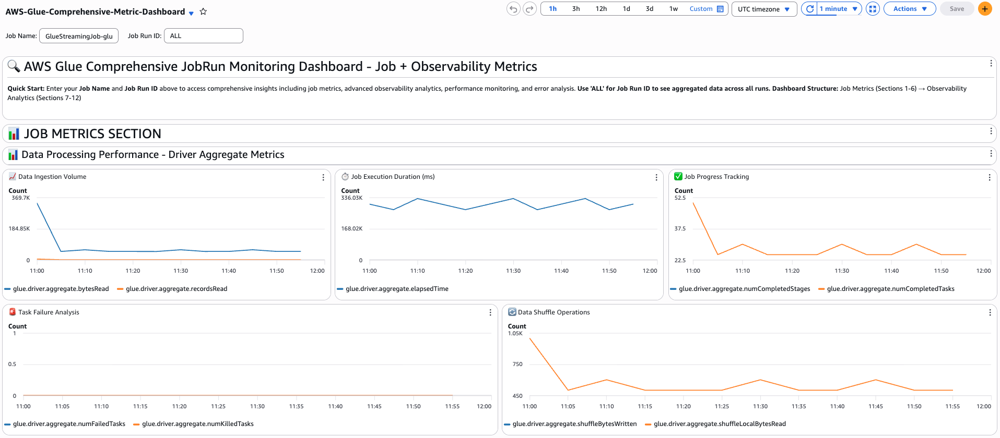
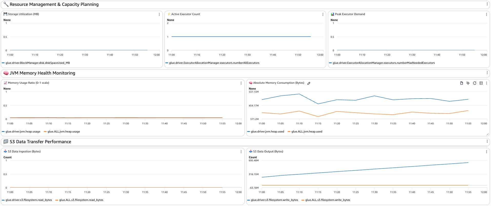
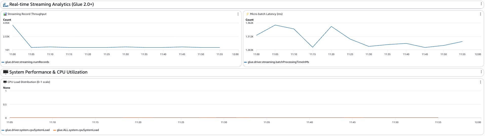

# Comprehensive AWS Glue Monitoring: Advanced CloudWatch Dashboards for ETL Performance Optimization

## Introduction

AWS Glue is a powerful serverless ETL service that processes vast amounts of data, but monitoring its performance can be challenging without proper visibility. This guide introduces a comprehensive monitoring solution featuring three specialized CloudWatch dashboards designed to provide deep insights into your Glue job performance, resource utilization, and error patterns.

## Dashboard Architecture Overview

Our monitoring solution consists of three complementary dashboards, each serving specific monitoring needs:

1. **Job Dashboard (Enhanced Metrics View)** - Core performance monitoring with 24 essential metrics
2. **Observability Dashboard** - Advanced analytics with 32 specialized metrics (Glue 4.0+)
3. **Comprehensive Dashboard** - Combined view with all 56 metrics for complete visibility

## Dashboard 1: Job Dashboard - Core Performance Monitoring

The Job Dashboard focuses on essential Glue job metrics that work across all Glue versions. It provides real-time insights into data processing performance, resource management, and system health.

### Key Features:
- **Data Processing Performance**: Track bytes read, records processed, and execution duration
- **Resource Management**: Monitor storage utilization, executor allocation, and capacity planning
- **JVM Memory Health**: Analyze heap usage patterns and memory consumption
- **S3 Transfer Performance**: Monitor data ingestion and output operations
- **Streaming Analytics**: Real-time metrics for Glue 2.0+ streaming jobs
- **System Performance**: CPU load distribution across driver and executors

### Critical Metrics Explained:

**Data Ingestion Volume**: Tracks `glue.driver.aggregate.bytesRead` and `glue.driver.aggregate.recordsRead` to monitor the volume of data being processed. High values indicate large-scale data operations, while sudden drops might signal data source issues.

**Job Execution Duration**: Monitors `glue.driver.aggregate.elapsedTime` to track how long jobs take to complete. This metric is crucial for SLA monitoring and identifying performance degradation over time.

**Task Failure Analysis**: Tracks `glue.driver.aggregate.numFailedTasks` and `glue.driver.aggregate.numKilledTasks` to identify reliability issues. Any non-zero values require immediate investigation.

## Dashboard 2: Observability Dashboard - Advanced Analytics

The Observability Dashboard leverages AWS Glue 4.0+ advanced metrics to provide deep insights into job performance patterns, error analysis, and resource optimization opportunities.

### Advanced Features:
- **Skewness Analysis**: Identify data distribution imbalances affecting performance
- **Error Categorization**: Comprehensive error tracking with 9 distinct error types
- **Worker Efficiency**: Monitor utilization rates and optimization opportunities
- **Advanced Memory Analytics**: Detailed heap vs non-heap memory analysis
- **Disk Management**: Track storage usage patterns and capacity planning

### Key Observability Metrics:

**Job Skewness**: The `glue.driver.skewness.job` metric identifies data distribution imbalances. Values above 5 indicate significant skew that can cause performance bottlenecks.

**Worker Utilization**: `glue.driver.workerUtilization` shows how efficiently your workers are being used. Values below 50% suggest over-provisioning, while values above 90% may indicate resource constraints.

**Error Categories**: Tracks specific error types including:
- `OUT_OF_MEMORY_ERROR`: Memory allocation failures
- `PERMISSION_ERROR`: IAM or access-related issues
- `THROTTLING_ERROR`: Service limit constraints
- `CONNECTION_ERROR`: Network connectivity problems

## Dashboard 3: Comprehensive Dashboard - Complete Monitoring

The Comprehensive Dashboard combines both job and observability metrics into a single view, providing the most complete monitoring solution available.

### Unified Monitoring Benefits:
- **Complete Visibility**: All 56 metrics in one dashboard
- **Cross-Reference Analysis**: Compare job metrics with observability insights
- **Comprehensive Troubleshooting**: Full context for performance issues
- **Structured Navigation**: Organized sections for efficient monitoring

## Dashboard Metrics Examples

The following screenshots demonstrate how the metrics appear in the actual CloudWatch dashboards, providing visual examples of the monitoring capabilities:



*Figure 1: Driver Aggregate Metrics from the Job Metric Section showing data ingestion volume, job execution duration, and progress tracking. These core performance metrics provide immediate visibility into job performance and help identify processing bottlenecks.*



*Figure 2: Resource Management metrics from the Job Metric Section displaying worker utilization efficiency, memory usage patterns, and disk space management. These advanced metrics help optimize resource allocation and identify capacity planning opportunities.*



*Figure 3: Streaming Analytics section showing real-time record throughput and micro-batch latency metrics. These metrics are essential for monitoring Glue 2.0+ streaming jobs and ensuring optimal real-time data processing performance.*

## Deployment Guide

### Prerequisites:
- AWS CLI configured with appropriate permissions
- CloudFormation deployment permissions
- AWS Glue jobs with metrics enabled

### Quick Deployment:

```bash
# Clone the repository
git clone https://github.com/ni-ti-n/glue-monitoring-dashboards.git
cd glue-monitoring-dashboards

# Deploy Job Dashboard
aws cloudformation deploy \
  --template-file glue-dashboards-unified-cfn.yaml \
  --stack-name glue-job-dashboard \
  --parameter-overrides DashboardType=Job DashboardName=MyGlueJobDashboard

# Deploy Observability Dashboard (requires Glue 4.0+)
aws cloudformation deploy \
  --template-file glue-dashboards-unified-cfn.yaml \
  --stack-name glue-observability-dashboard \
  --parameter-overrides DashboardType=observability DashboardName=MyGlueObservabilityDashboard

# Deploy Comprehensive Dashboard
aws cloudformation deploy \
  --template-file glue-dashboards-unified-cfn.yaml \
  --stack-name glue-comprehensive-dashboard \
  --parameter-overrides DashboardType=comprehensive DashboardName=MyGlueComprehensiveDashboard
```

### Configuration Parameters:

| Parameter | Description | Default | Options |
|-----------|-------------|---------|---------|
| `DashboardType` | Type of dashboard to deploy | `Job` | `Job`, `observability`, `comprehensive` |
| `DashboardName` | Name for the CloudWatch Dashboard | `AWS-Glue-Dashboard` | Any valid dashboard name |
| `DefaultJobName` | Default job name for filtering | `my-glue-job` | Your Glue job name |
| `DefaultJobRunId` | Default job run ID | `ALL` | Specific run ID or `ALL` |

## Monitoring Best Practices

### Performance Optimization:
1. **Monitor Memory Usage**: Keep heap usage below 80% to prevent OOM errors
2. **Track Skewness**: Values above 5 indicate need for data partitioning optimization
3. **Watch Worker Utilization**: Maintain 60-80% utilization for optimal cost-efficiency
4. **Analyze Task Failures**: Any failures require immediate investigation


### Troubleshooting Guide:

| Issue | Symptoms | Solution |
|-------|----------|----------|
| High Memory Usage | Heap usage > 80% | Increase executor memory or optimize data processing |
| Data Skew | Job skewness > 5 | Enable Adaptive Query Execution, optimize partitioning |
| Low Throughput | High execution time, low worker utilization | Increase parallelism, optimize transformations |
| Task Failures | Non-zero failed tasks | Check data quality, resource allocation, job logic |

## Advanced Features

### Variable Support:
All dashboards support dynamic filtering through CloudWatch variables:
- **Job Name**: Filter metrics by specific Glue job
- **Job Run ID**: Focus on specific job runs or use "ALL" for aggregated view

### Metric Categories:

**Job Dashboard (24 metrics):**
- Data Processing: 9 metrics
- Resource Management: 3 metrics  
- Memory Health: 4 metrics
- S3 Performance: 4 metrics
- Streaming Analytics: 2 metrics
- System Performance: 2 metrics

**Observability Dashboard (32 metrics):**
- Performance Analysis: 2 metrics
- Error Analytics: 9 metrics
- Resource Utilization: 14 metrics
- Throughput Analytics: 7 metrics

## Dashboard Costs:
- Each dashboard: ~$3/month for standard usage

## Conclusion

These comprehensive AWS Glue monitoring dashboards provide unprecedented visibility into your ETL operations. Whether you need basic job monitoring, advanced observability analytics, or complete comprehensive coverage, this solution scales to meet your monitoring requirements.

Start with the Job Dashboard for immediate value, then expand to Observability and Comprehensive dashboards as your monitoring maturity grows.

## Resources

- [AWS Glue Job Metrics Documentation](https://docs.aws.amazon.com/glue/latest/dg/monitoring-awsglue-with-cloudwatch-metrics.html)
- [CloudWatch Dashboard Documentation](https://docs.aws.amazon.com/AmazonCloudWatch/latest/monitoring/CloudWatch_Dashboards.html)
- [Glue Observability Metrics Reference](https://docs.aws.amazon.com/glue/latest/dg/monitor-observability.html)

---
